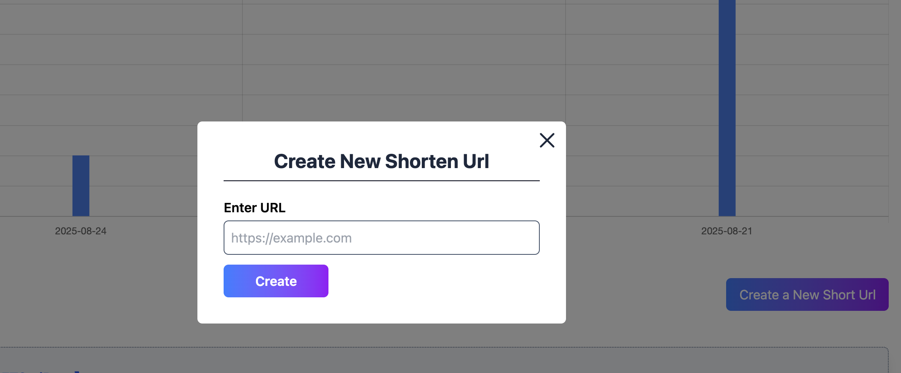
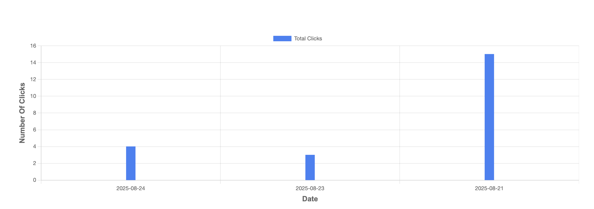
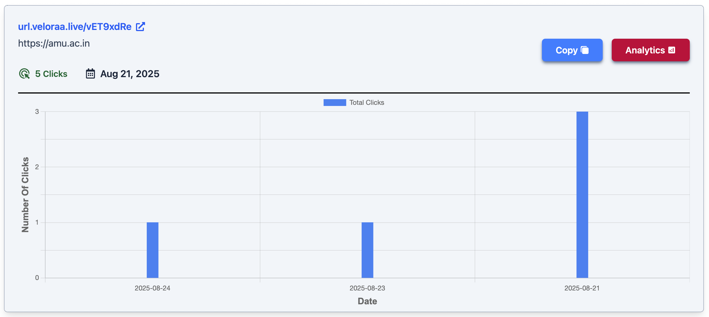

# 🔗 LinkClippr - URL Shortener

**Live Project :**
You can access the live project here: [LinkClippr Live](https://veloraa.live)  

---

##  Deployment Details  

This application is deployed across the following platforms:  

- **Render** (Backend Deployment)  
  - The backend (Spring Boot server) is hosted on [Render](https://render.com).  
  - ⚠️ **Note:** Since the backend uses Render’s free plan, the server may take a few minutes (or more) to start up if it hasn’t been accessed recently (cold start).  

- **Netlify** (Frontend Deployment)  
  - The React + Vite frontend is deployed on [Netlify](https://www.netlify.com).  
  - Provides a fast and globally distributed frontend hosting.  

- **NeonDB** (Database)  
  - The database is hosted on [Neon](https://neon.tech), a serverless Postgres platform.  
  - Neon offers autoscaling, branching, and a free tier suitable for development and testing.  

---

## Features

1. **Register and Login Functionality** – Secure user authentication to manage your shortened links.  
2. **Create Short URL** – Provide your long URL and get a shortened version instantly. 
<br>
<br>

<br>
<br> 
3. **Redirect Functionality** – Short URLs redirect seamlessly to the original destination.  
4. **Total Clicks (Date-wise)** – Track how many times your short URLs have been accessed.  
<br>
 
<br>
<br>
5. **URL-specific Details and Analytics** – Get in-depth insights for each short URL.  
<br>
<br>

<br>
<br>
6. **Logout Functionality** – End your session safely with a logout option.  

---


## Set up Application Locally

### Backend

**Commands:**

```bash
git clone https://github.com/g14ayushi/LinkCliprr.git
cd LinkCliprr
cd url-shortner-sb
```

The backend is built using **Spring Boot**. It can be run locally in multiple ways.

### Running the Backend Locally

The Spring Boot server runs on **port 8080**. Before setting up, make sure port 8080 is free.

Check if port 8080 is in use:

##### On Linux / macOS
```bash
lsof -i:8080
```

##### On Windows (PowerShell)
```bash
netstat -ano | findstr :8080
```

#### 1. Using Docker

Build the Docker image and run the container:

```bash
docker build -t linkclippr-backend .
docker run -p 8080:8080 linkclippr-backend
```

This will start the backend on `http://localhost:8080`.

#### 2. Using Maven Command

Run the Spring Boot application directly from the terminal with Maven:

```bash
mvn spring-boot:run
```

This will also start the backend on `http://localhost:8080`.

#### 3. Using IntelliJ IDEA

* Open the project in IntelliJ IDEA.
* Navigate to the main class containing `public static void main(String[] args)` (usually annotated with `@SpringBootApplication`).
* Click the **Run** button in the IDE toolbar.

This will launch the backend directly from the IDE.

---

### Application Properties Configuration

Before running the backend, make sure you configure the `application.properties` file located at: src/main/resources/application.properties


Below is a sample configuration:

```properties
# Application name
spring.application.name=url-shortner-sb

# Database configuration
spring.datasource.url=jdbc:mysql://localhost:3306/your_database_name
spring.datasource.username=your_user_name
spring.datasource.password=your_password

# JPA / Hibernate
spring.jpa.hibernate.ddl-auto=update
spring.jpa.properties.hibernate.dialect=org.hibernate.dialect.MySQL8Dialect

# JWT Configuration
jwt.secret=your_secret_key_here
jwt.expiration=172800000   # 2 days in milliseconds

# Frontend URL (adjust if needed)
frontend.url=http://localhost:5173
```

### Frontend

Navigate to the frontend folder `url-shortner-react`:

```bash
cd ../url-shortner-react
```

#### 1. Install Dependencies

```bash
npm install
```

#### 2. Start Development Server

```bash
npm run dev
```

This will start the frontend on `http://localhost:5173` (default Vite port).

---

### Database Setup

The backend uses **MySQL** for data storage.

#### 1. Install MySQL

Make sure MySQL is installed and running on your system.

#### 2. Create Database

Login to MySQL and create a database:

```sql
CREATE DATABASE linkclippr;
```

#### 3. Configure Database in Spring Boot

Open the `application.properties` (or `application.yml`) file in `url-shortner-sb/src/main/resources/` and update with your MySQL credentials:

```properties
spring.datasource.url=jdbc:mysql://localhost:3306/linkclippr
spring.datasource.username=your-username
spring.datasource.password=your-password
spring.jpa.hibernate.ddl-auto=update
```

#### 4. Verify Tables Creation

Once the backend starts, Hibernate will automatically create necessary tables inside the `linkclippr` database.

---

✅ Now you have the backend, frontend, and database set up locally. You can access the application by running both backend (`localhost:8080`) and frontend (`localhost:5173`).
